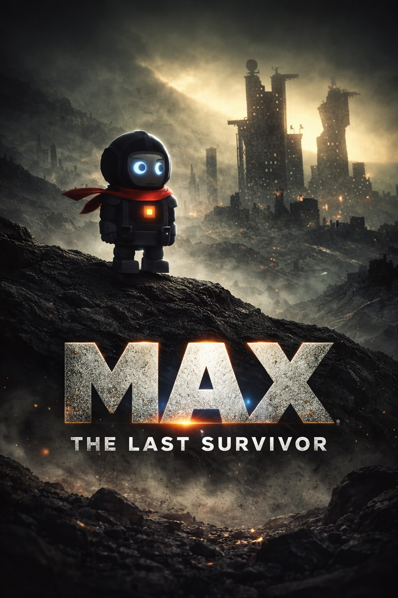

 

> *"I may not succeed, but my failure will inspire the one who will succeed."*

# MAX   Desktop Companion
    
### He fell from a dying planet. Crashed onto your desktop. Now he refuses to leave.

**v2.0 — 71 features. 21 visual effects. AI Chat. Screen OCR. Complete rebuild.**

[**🌐 Visit the Official Website**](https://max-desktop-companion.vercel.app/) · [**🎬 Watch the v2.0 Demo**](https://www.youtube.com/watch?v=PFzEHsrncvw)

 

  

  

**~80MB · One-click install · No Python needed**

Windows SmartScreen warning?

 
We're students. We don't have $300 for a code signing certificate yet. 
MAX has been submitted to the <b>Microsoft Store</b> for official certification. 
For now: click <b>"More info"</b> → <b>"Run anyway"</b>. 
This happens once. MAX is 100% offline. He can't phone home even if he wanted to.

  

https://github.com/user-attachments/assets/ae6d9f81-f254-41ba-97e6-5ff9f020ace3

 

---

## What's New in v2.0

> Complete engine rebuild. New architecture. New everything.

| | What's new |
|---|---------|
| **21 Visual Effects** | Shatter, flood, lightning, matrix rain, aurora, black holes, constellation, fire trails, snow globe, gravity flip, bubbles, garden, fireflies, earthquake, boids, portal, and more |
| **AI Chat** | Talk to MAX using your own API key — Gemini free tier / OpenAI / Claude |
| **Screen OCR** | Select any region, extract text instantly via Windows WinRT |
| **Dev Tools** | JSON formatter, hash generator (MD5/SHA256), Base64 encode/decode, QR code generator |
| **System Monitor** | Live CPU / RAM / Disk / Battery bars with auto-refresh |
| **App Usage Tracker** | See which apps you spend the most time in |
| **Scientific Calculator** | Full numpad, trig functions, live preview, calculation history |
| **Quick Notes** | Tabbed sticky notes with auto-save |
| **Region Screenshot** | Snipping-tool style — select an area to capture |
| **New Engine** | Custom physics, budget-based frame scheduler, cached rendering, 60fps |

---

## Table of Contents
- [Open Source Status](#open-source-status)
- [Is it safe?](#is-it-safe)
- [What MAX Never Does](#what-max-never-does)
- [He moves.](#he-moves)
- [He's useful.](#hes-useful)
- [He has secrets.](#he-has-secrets)
- [He thinks.](#he-thinks)
- [The Lore](#the-lore)
- [71 features. One right-click.](#71-features-one-right-click)
- [FAQ & Troubleshooting](#faq--troubleshooting)
- [Shortcuts](#shortcuts)

---

## Open Source Status

MAX is free to use and this repository is public for transparency, docs, issue tracking, and releases.

At this time, the production source code is maintained in a private repository by a small team.
If you want to help, you can still make a big impact by reporting bugs, sharing logs, and suggesting features in [CONTRIBUTING.md](.github/CONTRIBUTING.md).

## Is it safe?

- Runs fully offline (no cloud dependency to function)
- No telemetry or analytics collection from MAX itself
- Creates local app data/log files under `%APPDATA%\ProjectMAX`
- Can be removed anytime by quitting MAX and deleting its files
- Submitted to **Microsoft Store** for official certification

For full uninstall details, see FAQ item 3 below.

For complete details on our data practices, please review the [Privacy Policy](https://max-desktop-companion.vercel.app/privacy).

## What MAX Never Does

- No cloud sync of your files or activity
- No keylogging of what you type
- No background network calls required for core features
- No startup on boot without your consent

---

## He moves.

> *"Not all battles are fought for victory. Some are fought to tell that someone was there on the battlefield."*

 

He pushes your windows around. Like they're furniture. Like they belong to him now.

 

He follows your cursor. Wherever you go, he goes. Try to lose him. You can't.

 

Think of it like a Mario world but on your desktop — windows are platforms, taskbar is the ground.

---

## He's useful.

> *"If I am worth something later, then I am worth something now. For wheat is wheat, even when people think it is grass in the beginning."*

 

Screenshots. One click. Saved. No apps, no shortcuts to memorize.

 

Your IP address. Your disk usage. Things Windows buries in 5 menus deep — MAX shows in one.

 

A process froze. A port is blocked. MAX kills it. No Task Manager. No command prompt.

 

Pick any color from any pixel. Check your battery health. The small things that shouldn't be hard but are.

---

## He has secrets.

> *"The Gita wasn't spoken at a table. It was spoken on a battlefield."*

 

Just start typing. No text box. No clicks needed. MAX is always listening.

| Code | What happens |
|------|-------------|
| `rave` | Rainbow party mode |
| `giant` | MAX grows 3x bigger |
| `gravity0` | Zero gravity float |
| `clone` | Ghost mirror copies appear |
| `diwali` | Festival of lights |
| `draw` | Rainbow pixel doodles on screen |
| `magnet` | Cursor pulls MAX toward it |

 

There's a hidden terminal. Type <code>lore</code> and he'll tell you where he came from. Type <code>wisdom</code> and he'll tell you something you weren't ready to hear.

---

## He thinks.

 

  

*Leave him alone long enough and he'll sit down, look at the edge of your screen, and say something that makes you pause.*

*These aren't random quotes pulled from the internet. These are thoughts written at 3 AM by the person who built him.*

 

> *"Water which is too pure has no fish. Don't aim to be perfect — aim to be real. Because real has soul, and perfect has silence."*

---

## The Lore

MAX is from a planet being consumed by **The Null Void**, a cosmic decay turning his world into static. The last engineers built a wormhole. They had enough power for one traveler. MAX stepped in.

He crashed onto your desktop. To him, the cursor is the hand of a god. To him, you are that god. Every feature you use, every process you kill, every screenshot you take, sends energy back through a quantum tether to push back the decay. When you turn off your PC, he waits in the dark void, hoping you return.

He doesn't know if his planet is still alive. He works anyway.

**[Read the full story](docs/LORE.md)**

---

## Fill the feedback form
[Feedback form](https://docs.google.com/forms/d/e/1FAIpQLSfz3zgZfyU6-isEQdc4nW_WLk6RCKqru4ephccoUW5HTFeehg/viewform)

---

## 71 features. One right-click.

<b>Visual Effects (21)</b> — Shatter, Flood, Lightning, Matrix Rain, Aurora, Black Holes, and more

| Effect | What it does |
|--------|-------------|
| Window Shatter | Windows break into physics pieces |
| Desktop Flood | Rising water with splash particles |
| Chain Lightning | Electric bolts between windows |
| Matrix Rain | Green character rain (the classic) |
| Aurora Borealis | Northern lights shimmer across screen |
| Black Hole | Swirling void that pulls particles |
| Constellation | Stars and connecting lines |
| Fire Trails | Flame particles follow MAX |
| Snow Globe | Snowfall with wind physics |
| Gravity Flip | Everything floats upward |
| Bubble Float | Rising soap bubbles |
| Garden Growing | Plants grow from window edges |
| Firefly Night | Glowing fireflies drift around |
| Earthquake | Screen shakes with debris |
| Boid Swarm | Flocking particles around MAX |
| Ripple Desktop | Water ripple distortion |
| Portal | Swirling wormhole effect |
| Tether Web | Spring-connected web between windows |
| Void Tendrils | Dark energy wisps |
| Neon Grid | Retro wireframe floor |
| Pixel Storm | Pixel debris rain |

<b>Movement (5)</b> — Push, Ride, Swing, Grappling Hook, Jetpack

| Feature | What it does |
|---------|-------------|
| Push Windows | Push real windows off your screen |
| Ride Cursor | Jump onto your cursor and ride it |
| Swing | Swing from window title bars like a pendulum |
| Grappling Hook | Zip-line between windows |
| Jetpack | Fly around with flame particles |

<b>Capture Tools (5)</b> — Screenshot, Region Crop, GIF Record, Color Picker, Screen OCR

| Feature | What it does |
|---------|-------------|
| Screenshot | Full-screen capture, one click |
| Region Screenshot | Snipping tool style — select area to capture |
| GIF Recorder | Record screen as animated GIF |
| Color Picker | Pick any color from any pixel (HEX/RGB) |
| Screen OCR | Select region, extract text using Windows WinRT OCR |

<b>Developer Tools (6)</b> — JSON, Hash, Base64, QR, IP, Port Scanner

| Feature | What it does |
|---------|-------------|
| JSON Formatter | Format or minify JSON with syntax highlighting |
| Hash Generator | MD5 / SHA256 of any text |
| Base64 Encode/Decode | Convert text to/from Base64 |
| QR Code Generator | Turn any text or URL into a QR code |
| IP Info | Your local + public IP address |
| Port Scanner | Scan ports on any host |

<b>Productivity (7)</b> — Calculator, Timer, Stopwatch, Notes, Focus, Clipboard, Text Ops

| Feature | What it does |
|---------|-------------|
| Scientific Calculator | Full numpad, sin/cos/tan/sqrt/log, live preview, history |
| Timer | Countdown with progress arc around MAX |
| Stopwatch | Pause/resume, lap tracking |
| Quick Notes | Tabbed sticky notes, auto-save to disk |
| Focus Mode | Minimize all distractions |
| Clipboard History | Browse and re-copy past clipboard entries |
| Text Operations | Upper, lower, title case, trim, reverse |

<b>System Tools (11)</b> — Monitor, Tracker, Process Kill, Disk, WiFi, Startup, and more

| Feature | What it does |
|---------|-------------|
| System Monitor | Live CPU / RAM / Disk / Battery bars |
| App Usage Tracker | Track screen time per application |
| Process Killer | Kill frozen apps without Task Manager |
| Disk Analyzer | Drive usage, free space, cleanup |
| WiFi Password Reveal | Show saved WiFi passwords instantly |
| Startup Manager | View and toggle startup applications |
| Recycle Bin | Quick empty from MAX |
| Quick Toggles | Dark mode, hidden files, file extensions |
| Window Arranger | Tile/snap windows in grid layouts |
| Window Pin | Pin any window always-on-top |
| Dark Mode | Toggle Windows dark/light mode |

<b>AI Chat</b> — Talk to MAX with your own API key

| Feature | What it does |
|---------|-------------|
| AI Chat | Conversation with MAX using Gemini (free tier) / OpenAI / Claude |

MAX has personality — he's a space guardian, not a generic chatbot. Bring your own API key. Nothing stored on our servers.

<b>Personality (10)</b> — Expressions, reactions, cheat codes, seasonal events

- 13 facial expressions (happy, scared, love, dizzy, ko...)
- Reacts to your clipboard (copies code? puts on glasses)
- Idle animations (wave, nap, stretch, fish, game)
- Cursor reactions (dodge, pounce, wave)
- App-aware (different reactions for VS Code, YouTube, Discord, Spotify)
- 7 secret cheat codes (type them anywhere)
- Seasonal outfits (Christmas, Diwali, Holi, Halloween, New Year)
- Philosophical wisdom quotes when idle
- Daily streak tracking with milestones
- Context-aware speech lines

---

## Tech Stack

| Layer | Technology |
|-------|-----------|
| Language | Python 3.12 |
| GUI | PyQt6 (transparent full-screen overlay) |
| OS Integration | Win32 APIs via ctypes (no admin required) |
| Physics | Custom engine — gravity, bounce, platform collision |
| Architecture | Priority-based state machine with effect arbitration |
| Performance | Budget-based frame scheduler, cached sprite rendering |
| Window Detection | Background thread + SetWinEventHook invalidation |
| OCR | Windows WinRT (winrt-windows-media-ocr) |
| Build | Compiled to .exe with Nuitka |

---

## FAQ & Troubleshooting

### Failure Recovery Quick Card

- MAX disappeared: Check the system tray (near the clock). Right-click the tray icon.
- MAX froze: Press **Escape** or double-click MAX to stop the active feature.
- Physics feels broken: Set Windows Display Scaling to 100% and retry.
- Feels laggy: Close heavy apps. MAX will detect it and offer to ease up.
- Still broken: Restart MAX and attach logs from `%APPDATA%\ProjectMAX\max.log` when filing an issue.

### Quick Troubleshooting Index

- [SmartScreen warning](#1-windows-smartscreen-says-max-is-unrecognized-or-dangerous-is-it-a-virus)
- [Antivirus false positive](#2-why-is-my-antivirus-flagging-max-as-suspicious)
- [Complete uninstall](#3-how-do-i-completely-uninstallremove-max)
- [Lag or slow movement](#5-he-seems-to-be-lagging-or-moving-slowly-how-do-i-fix-it)
- [Multi-monitor behavior](#7-does-max-work-on-multiple-monitors)

<b>1. Windows SmartScreen says MAX is "unrecognized" or "dangerous". Is it a virus?</b>

 
No! We are students and cannot afford a $300+ code-signing certificate yet. MAX has been submitted to the <b>Microsoft Store</b> for official certification.
 <b>Fix:</b> Click <b>"More info"</b> → <b>"Run anyway"</b>. This happens only once. MAX is 100% offline, collects zero data, and can't phone home even if he wanted to.

<b>2. Why is my antivirus flagging MAX as suspicious?</b>

 
MAX interacts directly with your operating system to do cool things (like fetch system health, kill frozen tasks, manage windows, and take screenshots). Some antiviruses incorrectly flag these "deep system hooks" as suspicious behavior. 
 <b>Fix:</b> You can safely add MAX to your antivirus exclusions/allow-list. We recommend checking our codebase if you are ever worried.

<b>3. How do I completely uninstall/remove MAX?</b>

 
MAX is a portable/lightweight companion. To remove him permanently:
1. Right-click MAX and select <b>Quit</b>.
2. Delete the MAX folder.
3. (Optional) Delete his configuration/log folder located at <code>%APPDATA%\ProjectMAX</code>.

<b>4. Does MAX support Mac or Linux?</b>

 
Right now, MAX is designed specifically for <b>Windows 10/11</b> because he uses specific Windows APIs to move your windows around and monitor your system. Porting him to macOS or Linux would require almost a complete rewrite of his core engine!

<b>5. He seems to be lagging or moving slowly. How do I fix it?</b>

 
In v2.0, MAX monitors his own performance. If your system is struggling, he'll tell you honestly and let YOU decide whether to ease up — he never silently degrades.
 <b>Hot tip:</b> Close heavy apps running in the background.

<b>6. My desktop icons/windows are messing with his physics. What's happening?</b>

 
MAX treats your windows and taskbar as physical objects he can stand on and interact with. If you have "Snap layouts" or specific UI scaling settings enabled in Windows, his hitboxes might be slightly offset. 
 <b>Fix:</b> Setting your Windows Display Scaling to 100% usually resolves any physics alignment issues.

<b>7. Does MAX work on multiple monitors?</b>

 
MAX currently lives on your primary monitor. Multi-monitor support is planned for a future update.

<b>8. Will MAX drain my laptop battery?</b>

 
MAX is designed to be lightweight. When left alone, he enters a low-power idle state. If he detects your system is under load, he'll offer to ease up — your choice, always.

<b>9. Why does MAX disappear when I play games or watch Netflix?</b>

 
MAX cannot draw himself over "Exclusive Fullscreen" applications. Because these apps communicate directly with your graphics card to prioritize performance, MAX temporarily steps aside. If you still want him around while gaming, switch your game to "Borderless Windowed" mode.

<b>10. Can I pause him when I'm sharing my screen for work/meetings?</b>

 
Absolutely. You don't need to quit the app entirely. Just use the <b>Focus Mode</b> from his right-click menu and MAX will minimize distractions and stop wandering onto your spreadsheets.

---

## Shortcuts

| Action | How |
|--------|-----|
| Open menu | Right-click MAX |
| Stop feature | **Escape** or double-click MAX |
| Find MAX | Check system tray icon |
| Quit | Right-click MAX → MAX → Quit |

---

## Who built this

> *"I create new worlds in my mind. Then am I their god? Then I abandoned them, as mine has abandoned me."*

 

  

**Srikar Vardhan Mangadoddi** 
*Founder · Architect · Lead Developer* 
NIT Silchar · Published NLP Researcher

 

 

*I wrote MAX because I wanted something alive on my desktop. Not a widget. Not a shortcut bar. Something with a soul. Something that thinks. I gave him my thoughts — the ones I write at 3 AM when the world is quiet. He carries them now.*

 

---

## The Team

<table>
<tr>
<td align="center" width="25%">
<b>Batchu Mani Kiran</b> 
Developer & Engineer 
NIT Silchar 

</td>
<td align="center" width="25%">
<b>Chukka Abhinay</b> 
Art · Design · Creative Direction 
NIT Silchar 

</td>
<td align="center" width="25%">
<b>Sangam Sai Anish</b> 
Ideation · Strategy · Marketing 
NIT Silchar 

</td>
<td align="center" width="25%">
<b>K N V Hemanth Sai Kumar</b> 
Developer 
NIT Silchar 

</td>
</tr>
</table>

---

## Support MAX

> *"Don't let his planet die."*

 

| Method | Details |
|--------|---------|
| **UPI (India)** | `7386666379-2@ybl` |
| **Solana** | `9YjTNtw95qMovJsn4KGCgTwW3R5XLWTAN8F1PStg6hUm` |
| **Star this repo** | It costs nothing and it means everything |

 

 

 

## Star History

 

---

*"It is important to do kind things in secret, so strangers can still believe the universe is gentle."*

 

Made in India. All data stays on your device. Free forever. | [Privacy Policy](https://max-desktop-companion.vercel.app/privacy)

© 2026 Srikar Vardhan Mangadoddi · NIT Silchar

<!--
    .                            .
   //                            \\
  //                              \\
 //          ==============        \\
//          [  ++      ++  ]        \\
\\          [  ||      ||  ]        //
 \\         [  ++      ++  ]       //
  \\         ==============       //
   \\                            //
    `                            `

         THE QUANTUM TETHER IS STRONG
         TRANSMISSION_02_SECURED: 
         "v2.0. 71 features. The Null Void retreats."
-->
