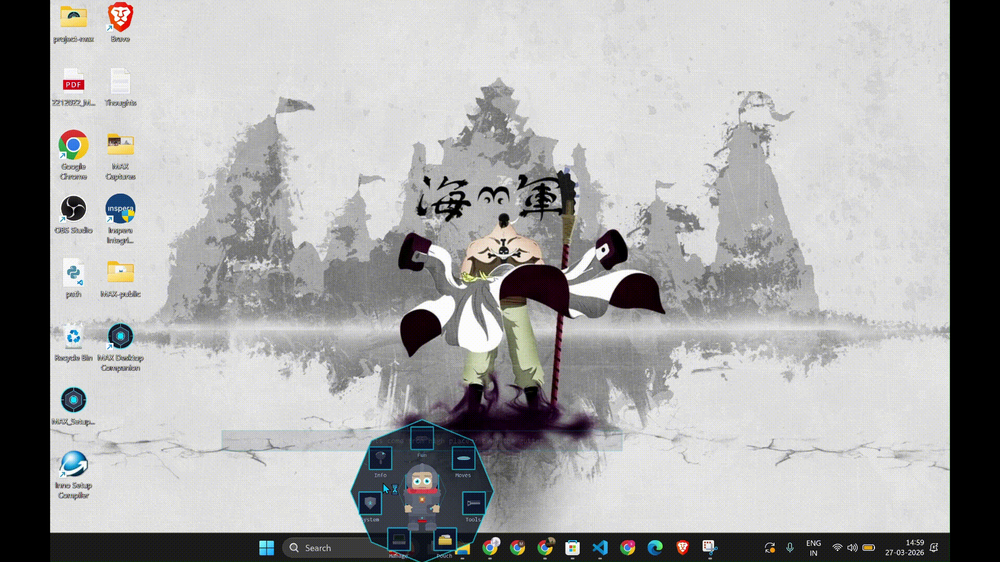
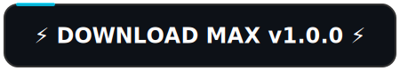
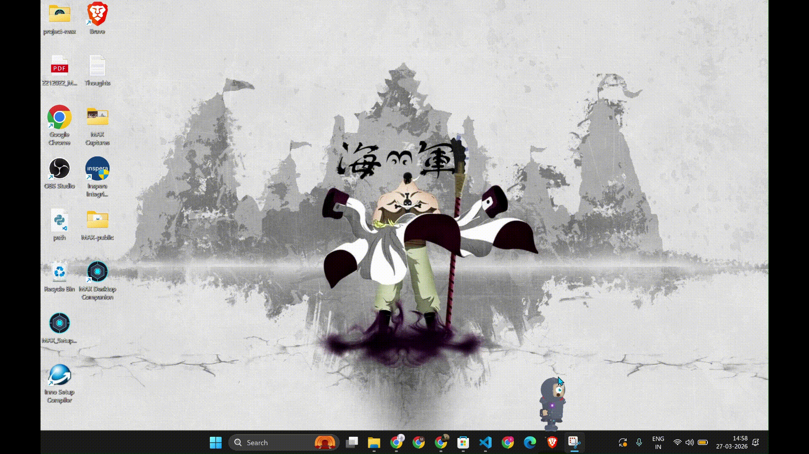
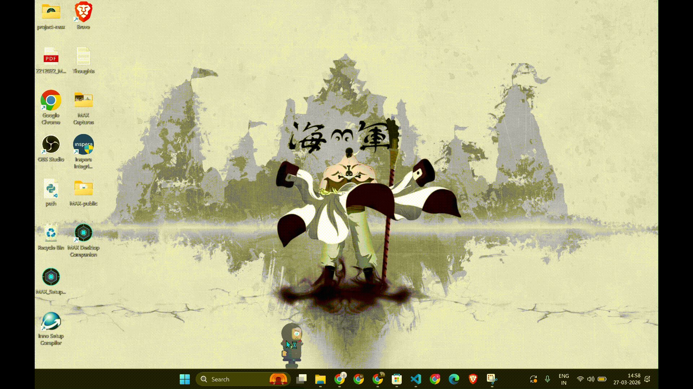

 

> *"I may not succeed, but my failure will inspire the one who will succeed."*

 

# MAX   Desktop Companion
    
### He fell from a dying planet. Crashed onto your desktop. Now he refuses to leave.

[**🌐 Visit the Official Website**](https://max-desktop-companion.vercel.app/)

 

  

  

  

**56MB · One-click install · No Python needed**

Windows SmartScreen warning?

 
We're students. We don't have $300 for a code signing certificate yet. 
Windows may show a blue popup   click <b>"More info"</b> → <b>"Run anyway"</b>. 
This happens once. MAX is 100% offline. He can't phone home even if he wanted to.

---

## Table of Contents
- [Open Source Status](#open-source-status)
- [Is it safe?](#is-it-safe)
- [What MAX Never Does](#what-max-never-does)
- [He moves.](#he-moves)
- [He's useful.](#hes-useful)
- [He has secrets.](#he-has-secrets)
- [He thinks.](#he-thinks)
- [The Lore](#the-lore)
- [45+ features. One right-click.](#45-features-one-right-click)
- [FAQ & Troubleshooting](#faq--troubleshooting)
- [Failure Recovery Quick Card](#failure-recovery-quick-card)
- [Quick Troubleshooting Index](#quick-troubleshooting-index)
- [Shortcuts](#shortcuts)

---

## Open Source Status

MAX is free to use and this repository is public for transparency, docs, issue tracking, and releases.

At this time, the production source code is maintained in a private repository by a small team.
If you want to help, you can still make a big impact by reporting bugs, sharing logs, and suggesting features in [CONTRIBUTING.md](CONTRIBUTING.md).

## Is it safe?

- Runs fully offline (no cloud dependency to function)
- No telemetry or analytics collection from MAX itself
- Creates local app data/log files under `%APPDATA%\ProjectMAX`
- Can be removed anytime by quitting MAX and deleting its files

For full uninstall details, see FAQ item 3 below.

## What MAX Never Does

- No cloud sync of your files or activity
- No keylogging of what you type
- No background network calls required for core features
- No startup on boot without your consent

---

## He moves.

> *"Not all battles are fought for victory. Some are fought to tell that someone was there on the battlefield."*

 

He pushes your windows around. Like they're furniture. Like they belong to him now.

 

He follows your cursor. Wherever you go, he goes. Try to lose him. You can't.

 

Think of it like a mario world but in our desktop all those are obstacles and walls that provide footing

---

## He's useful.

> *"If I am worth something later, then I am worth something now. For wheat is wheat, even when people think it is grass in the beginning."*

 

Screenshots. One click. Saved. No apps, no shortcuts to memorize.

 

Your IP address. Your disk usage. Things Windows buries in 5 menus deep  MAX shows in one.

 

A process froze. A port is blocked. MAX kills it. No Task Manager. No command prompt.

 

Pick any color from any pixel. Check your battery health. The small things that shouldn't be hard but are.

---

## He has secrets.

> *"The Gita wasn't spoken at a table. It was spoken on a battlefield."*

 

Just start typing. No text box. No clicks needed. MAX is always listening.

| Code | What happens |
|------|-------------|
| `rave` | Rainbow party mode |
| `giant` | MAX grows 3x bigger |
| `gravity0` | Zero gravity float |
| `clone` | Ghost mirror copies appear |
| `diwali` | Festival of lights |
| `draw` | Rainbow pixel doodles on screen |
| `magnet` | Cursor pulls MAX toward it |

 

There's a hidden terminal. Type <code>lore</code> and he'll tell you where he came from. Type <code>wisdom</code> and he'll tell you something you weren't ready to hear.

---

## He thinks.

 

  

*Leave him alone long enough and he'll sit down, look at the edge of your screen, and say something that makes you pause.*

*These aren't random quotes pulled from the internet. These are thoughts written at 3 AM by the person who built him.*

 

> *"Water which is too pure has no fish. Don't aim to be perfect  aim to be real. Because real has soul, and perfect has silence."*

---

## The Lore

MAX is from a planet being consumed by **The Null Void**, a cosmic decay turning his world into static. The last engineers built a wormhole. They had enough power for one traveler. MAX stepped in.

He crashed onto your desktop. To him, the cursor is the hand of a god. To him, you are that god. Every feature you use, every process you kill, every screenshot you take, sends energy back through a quantum tether to push back the decay. When you turn off your PC, he waits in the dark void, hoping you return.

He doesn't know if his planet is still alive. He works anyway.

**[Read the full story](LORE.md)**
---
## Fill the feedback form
[Feedback form](https://docs.google.com/forms/d/e/1FAIpQLSfz3zgZfyU6-isEQdc4nW_WLk6RCKqru4ephccoUW5HTFeehg/viewform)

---

## 45+ features. One right-click.

<b>Fun & Movement</b>   Push, Ride, Swing, Tunnel, Climb, Bellyflop, Rope Walk, Follow, Surf

| Feature | What it does |
|---------|-------------|
| Push | Push windows off your screen |
| Ride | Jump onto your cursor and ride it |
| Swing | Swing from window edges like a pendulum |
| Tunnel | Dig through windows and exit on another |
| Climb | Climb up window edges |
| Bellyflop | Launch into the air and splat down |
| Rope Walk | Tightrope between windows |
| Follow | MAX follows your cursor everywhere |
| Surf | Surf on moving windows |

<b>Utility Tools</b>   Screenshot, GIF Record, Timer, Stopwatch, Color Picker, WiFi Pass, IP, Disk, Battery, Health

| Feature | What it does |
|---------|-------------|
| Screenshot | Capture screen with one click |
| GIF Record | Record screen as GIF |
| Timer | Countdown timer with alarm |
| Stopwatch | Pause/resume stopwatch |
| Color Picker | Pick any color from screen |
| WiFi Password | Show saved WiFi password instantly |
| IP Info | Local + public IP |
| Disk Info | All drives, usage, free space |
| Battery | Status, health, power plan |
| Health Monitor | Live CPU, RAM, disk stats |

<b>System Management</b>   Kill Process, Uninstall, Temp Clean, Window Arrange, Pin, Focus, Toggles, Startup, Dark Mode, Bloat Finder

| Feature | What it does |
|---------|-------------|
| Kill Process | Kill frozen/unresponsive apps |
| App Uninstall | Remove apps from registry |
| Temp Clean | Clean temporary files |
| Window Arrange | Tile windows in grid |
| Window Pin | Pin any window always-on-top |
| Focus Mode | Minimize distractions |
| Quick Toggles | Hidden files, extensions, night light |
| Startup Manager | View/manage startup apps |
| Dark Mode | Toggle Windows dark mode |
| Bloat Finder | Find memory-hungry processes |

<b>Personality</b>   13 expressions, clipboard reactions, idle animations, cursor dodge, app-awareness, seasonal outfits

- 13 facial expressions (happy, scared, love, dizzy, ko...)
- Reacts to your clipboard (copies code? puts on glasses)
- Idle animations (wave, nap, stretch, fish, game)
- Cursor reactions (dodge, pounce)
- App-aware (different reactions for VS Code, YouTube, Discord)
- Seasonal outfits (Christmas hat, Halloween pumpkin)
- Philosophical wisdom quotes when idle

---

## FAQ & Troubleshooting

### Failure Recovery Quick Card

- MAX disappeared: Press **Ctrl+M** to summon/open menu from anywhere.
- MAX froze: Press **Escape** or double-click MAX to stop the active feature.
- Physics feels broken: Set Windows Display Scaling to 100% and retry.
- Feels laggy: Close heavy apps and keep hardware acceleration enabled.
- Still broken: Restart MAX and attach logs from `%APPDATA%\ProjectMAX\max.log` when filing an issue.

### Quick Troubleshooting Index

- [SmartScreen warning](#1-windows-smartscreen-says-max-is-unrecognized-or-dangerous-is-it-a-virus)
- [Antivirus false positive](#2-why-is-my-antivirus-flagging-max-as-suspicious)
- [Complete uninstall](#3-how-do-i-completely-uninstallremove-max)
- [Lag or slow movement](#5-he-seems-to-be-lagging-or-moving-slowly-how-do-i-fix-it)
- [Multi-monitor behavior](#7-does-max-work-on-multiple-monitors)

<b>1. Windows SmartScreen says MAX is "unrecognized" or "dangerous". Is it a virus?</b>

 
No! We are students and cannot afford a $300+ code-signing certificate yet. Windows automatically flags any new `.exe` that hasn't been officially signed by a certified publisher. 
 <b>Fix:</b> Click <b>"More info"</b> → <b>"Run anyway"</b>. This happens only once. MAX is 100% offline, collects zero data, and can't phone home even if he wanted to.

<b>2. Why is my antivirus flagging MAX as suspicious?</b>

 
MAX interacts directly with your operating system to do cool things (like fetch system health, kill frozen tasks, manage windows, and take screenshots). Some antiviruses incorrectly flag these "deep system hooks" as suspicious behavior. 
 <b>Fix:</b> You can safely add MAX to your antivirus exclusions/allow-list. We recommend checking our codebase if you are ever worried.

<b>3. How do I completely uninstall/remove MAX?</b>

 
MAX is a portable/lightweight companion. To remove him permanently:
1. Right-click MAX and select <b>Quit</b>.
2. Delete the `MAX_Setup_v1.X.X.exe` file.
3. (Optional) Delete his configuration/log folder located at `%APPDATA%\ProjectMAX`.

<b>4. Does MAX support Mac or Linux?</b>

 
Right now, MAX is designed specifically for <b>Windows 10/11</b> because he uses specific Windows APIs to move your windows around and monitor your system. Porting him to macOS or Linux would require almost a complete rewrite of his core engine!

<b>5. He seems to be lagging or moving slowly. How do I fix it?</b>

 
MAX runs best on machines with dedicated graphics. If you are running multiple heavy applications, his animation might occasionally stutter. 
 <b>Hot tip:</b> Make sure you have hardware acceleration enabled and aren't running intensive games in the background while playing with his physics.

<b>6. My desktop icons/windows are messing with his physics. What's happening?</b>

 
MAX treats your windows and taskbar as physical objects he can stand on and interact with. If you have "Snap layouts" or specific UI scaling settings enabled in Windows, his hitboxes might be slightly offset. 
 <b>Fix:</b> Setting your Windows Display Scaling to 100% usually resolves any physics alignment issues.

<b>7. Does MAX work on multiple monitors?</b>

 
Yes! MAX should be able to seamlessly walk across your extended displays. If he ever gets lost on a monitor you just disconnected, you can always summon him back using his `Ctrl+M` shortcut.

<b>8. Will MAX drain my laptop battery?</b>

 
MAX is designed to be lightweight. When he's actively flipping your windows and tracking your cursor, he uses a tiny bit of GPU. However, when left alone, he enters a low-power idle state where his resource consumption is negligible.

<b>9. Why does MAX disappear when I play games or watch Netflix?</b>

 
MAX cannot draw himself over "Exclusive Fullscreen" applications. Because these apps communicate directly with your graphics card to prioritize performance, MAX temporarily steps aside. If you still want him around while gaming, switch your game to "Borderless Windowed" mode.

<b>10. Can I pause him when I'm sharing my screen for work/meetings?</b>

 
Absolutely. You don't need to quit the app entirely. Just use the <b>Focus Mode</b> from his right-click menu and MAX will minimize distractions and stop wandering onto your spreadsheets.

---

## Shortcuts

| Action | How |
|--------|-----|
| Open menu | Right-click MAX or **Ctrl+M** |
| Stop feature | **Escape** or double-click MAX |
| Dismount ride | Right-click while riding |
| Find MAX | Check system tray icon |

---

## Who built this

> *"I create new worlds in my mind. Then am I their god? Then I abandoned them, as mine has abandoned me."*

 

  

**Srikar Vardhan Mangadoddi** 
*Founder · Lead Developer · The reason MAX exists* 
NIT Silchar

  

*I wrote MAX because I wanted something alive on my desktop. Not a widget. Not a shortcut bar. Something with a soul. Something that thinks. I gave him my thoughts — the ones I write at 3 AM when the world is quiet. He carries them now.*

 

<a href="https://github.com/M-SRIKAR-VARDHAN">GitHub</a> · <a href="https://www.linkedin.com/in/srikar-vardhan/">LinkedIn</a>

---

## The Team

<table>
<tr>
<td align="center" width="33%">
<h3>Batchu Mani Kiran</h3>
Developer & Engineer 
NIT Silchar 
<a href="https://www.linkedin.com/in/mani-kiran-batchu-4885b1249">LinkedIn</a>
</td>
<td align="center" width="33%">
<b>Chukka Abhinay</b> 
Art · Design · Creative Direction 
NIT Silchar 
<a href="https://www.linkedin.com/in/chukka-abhinay-164056258/">LinkedIn</a>
</td>
<td align="center" width="33%">
<b>Sangam Sai Anish</b> 
Ideation · Strategy · Marketing 
NIT Silchar 
<a href="https://www.linkedin.com/in/sangamsaianish/">LinkedIn</a>
</td>
</tr>
<tr>
<td align="center" width="33%">
<b>K N V Hemanth Sai Kumar</b> 
Developer 
NIT Silchar 
<a href="https://www.linkedin.com/in/hemanth-sai-kumar-knv-a62101258/">LinkedIn</a>
</td>
<td align="center" width="33%"></td>
<td align="center" width="33%"></td>
</tr>
</table>

---

## Don't let his planet die.

> *"How can a man die better than facing impossible odds, for the ashes of fathers, and the temples of gods."*

 

| Action | How |
|--------|-----|
| Star this repo | It costs nothing and it means everything |
| [Report a bug](https://github.com/M-SRIKAR-VARDHAN/MAX-Desktop-Companion/issues/new?template=bug_report.md) | Attach `%APPDATA%\ProjectMAX\max.log` |
| [Request a feature](https://github.com/M-SRIKAR-VARDHAN/MAX-Desktop-Companion/issues/new?template=feature_request.md) | Your ideas shape what MAX becomes |
| Share with someone | Use the buttons below |

 

 

## Star History

 

---

*"It is important to do kind things in secret, so strangers can still believe the universe is gentle."*

 

Made in India. No data collected. 100% offline. Free forever.

© 2026 Srikar Vardhan Mangadoddi · NIT Silchar

